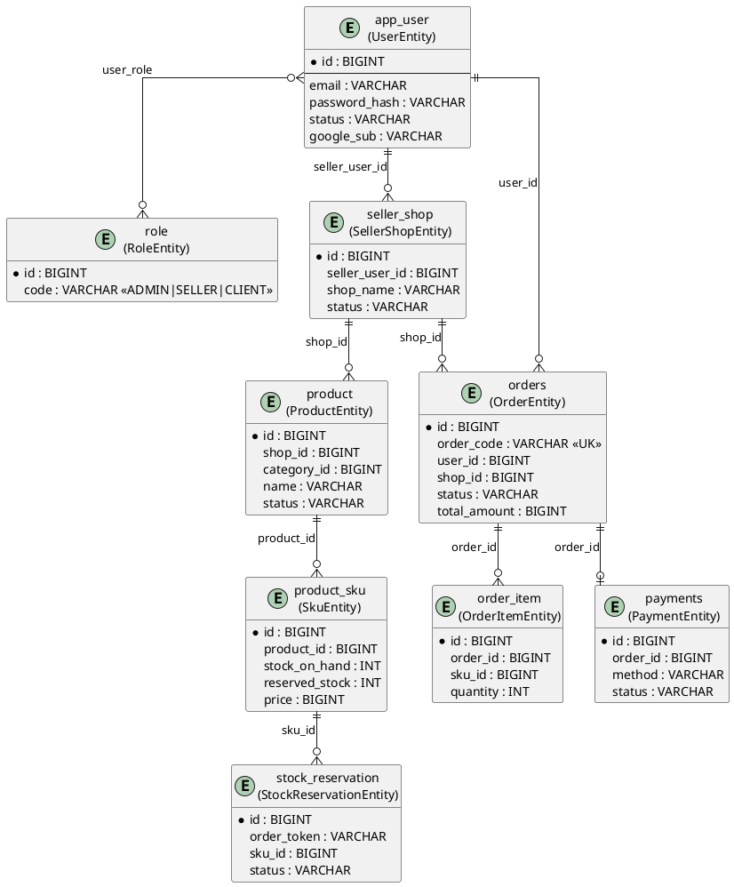
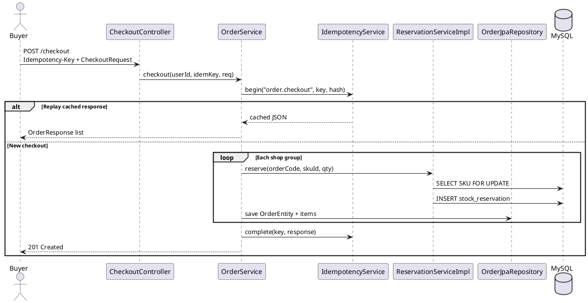
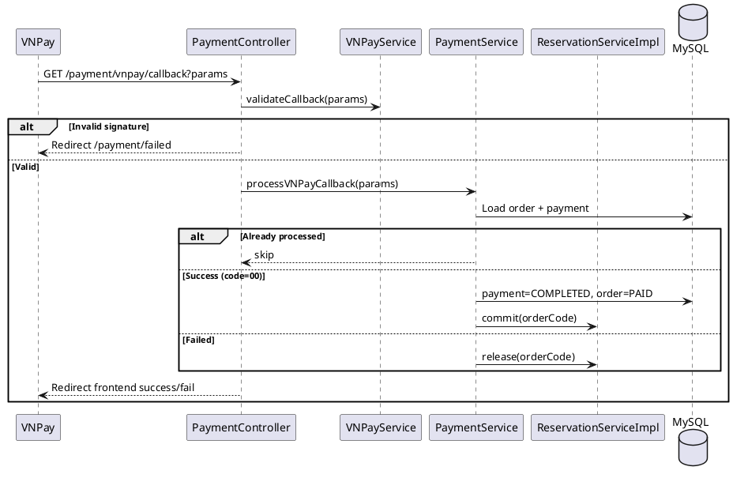
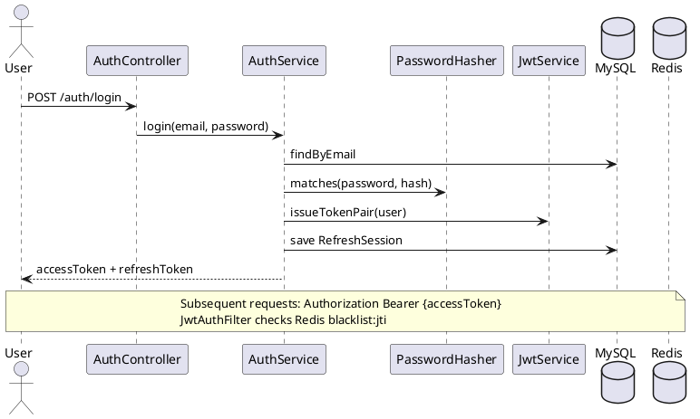
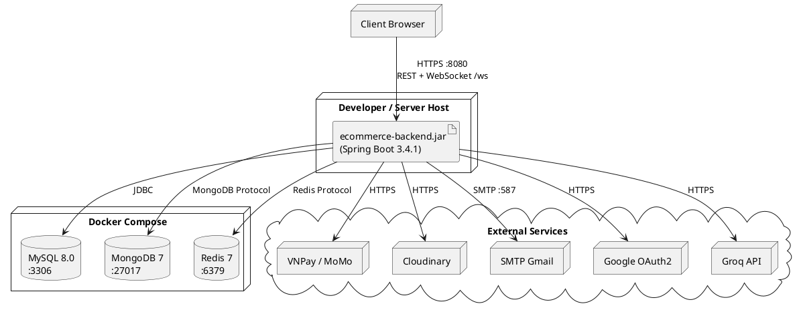

# Software Architecture Document – ShopMart Backend

| Trường | Nội dung |
|--------|----------|
| **Hệ thống** | ShopMart – Nền tảng thương mại điện tử đa người bán |
| **Repository** | `ecommerce-backend` (`com.example.ecommerce:ecommerce-backend:0.0.1-SNAPSHOT`) |
| **Phiên bản tài liệu** | 3.0 |
| **Ngày soạn** | 24/05/2026 |
| **Phương pháp** | Phân tích trực tiếp source code + Flyway migration (V0001–V0139) |
| **Trạng thái** | Baseline – Evidence-based |

---

## Phụ lục A – Kết quả quét codebase (Pre-SAD Scan)

### A.1 Cây thư mục chính

```
ecommerce-backend/
├── pom.xml                          # Maven, Spring Boot 3.4.1, Java 21
├── docker-compose.yml               # MySQL 8, MongoDB 7, Redis 7
├── docs/                            # Tài liệu kiến trúc, schema, API guide
├── scripts/                         # start-dev, seed-data
├── logs/                            # Log file xoay vòng
└── src/
    ├── main/
    │   ├── java/com/example/ecommerce/ecommerce_backend/
    │   │   ├── EcommerceBackendApplication.java
    │   │   ├── api/                 # Controller, DTO, filter, security, exception
    │   │   ├── application/service/ # Business logic (~59 service)
    │   │   ├── domain/              # Order, Payment, Refund enums & domain model (một phần)
    │   │   ├── infrastructure/      # Config, bootstrap, persistence (MySQL/Mongo/Redis)
    │   │   └── shared/util/
    │   └── resources/
    │       ├── application.yaml, application-dev.yaml, application-prod.yaml
    │       ├── db/migration/        # 90 file Flyway SQL
    │       └── templates/email/
    └── test/java/                   # 9 test class
```

### A.2 Framework & công nghệ xác định từ codebase

| Thành phần | Bằng chứng | Trạng thái |
|------------|------------|------------|
| **Framework** | Spring Boot 3.4.1 (`pom.xml`) | Implemented in codebase |
| **Ngôn ngữ** | Java 21 | Implemented in codebase |
| **Build** | Maven | Implemented in codebase |
| **Web/API** | Spring Web, SpringDoc OpenAPI 2.8.3 | Implemented in codebase |
| **Security** | Spring Security + JWT (JJWT 0.13.0) + OAuth2 Client (Google) | Implemented in codebase |
| **ORM** | Spring Data JPA / Hibernate | Implemented in codebase |
| **DB chính** | MySQL 8.0 (`application-dev.yaml`, `docker-compose.yml`) | Implemented in codebase |
| **DB phụ** | MongoDB 7 (event log, chat, recommendation events) | Implemented in codebase |
| **Cache/Session** | Redis 7 (OTP, JWT blacklist, rate limit) | Implemented in codebase |
| **Migration** | Flyway (`spring.flyway.enabled=true`) | Implemented in codebase |
| **Real-time** | WebSocket STOMP (`WebSocketConfig`) | Implemented in codebase |
| **Payment** | VNPay (`VNPayService`), MoMo (`MomoService`) | Implemented in codebase |
| **Email** | Spring Mail + Thymeleaf templates | Implemented in codebase |
| **File storage** | Cloudinary (mặc định), Local fallback | Implemented in codebase |
| **AI** | Groq API (`AiAssistantService`, `GroqClient`) | Implemented in codebase |
| **Monitoring** | Actuator + Prometheus (Micrometer) | Implemented in codebase |
| **SMS/OTP gateway** | OTP lưu Redis, log ra console | Partially implemented |
| **Message Queue** | Không thấy Kafka/RabbitMQ | Required but not found in codebase |
| **CI/CD** | Không có `.github/workflows` | Required but not found in codebase |
| **Google Cloud Storage** | Dependency trong `pom.xml`, không có implementation class | Partially implemented |

### A.3 Kiến trúc phân lớp thực tế

| Layer | Package | Số lượng ước lượng |
|-------|---------|-------------------|
| API/Controller | `api.controller` | 45 `@RestController` |
| Application/Service | `application.service` | ~59 `@Service` |
| Domain (một phần) | `domain.order`, `domain.payment`, … | 12 class |
| Persistence Entity | `infrastructure.persistence.mysql.entity` | 40 `@Entity` |
| Mongo Document | `infrastructure.persistence.mongo.document` | 4 document |
| Repository | `infrastructure.persistence.mysql.repository` | 39 JPA repo |
| Config/Infrastructure | `infrastructure.config`, `api.config` | ~20 class |

**Kết luận kiến trúc:** **Layered Architecture / Modular Monolith** — không phải microservices, không phải Clean Architecture đầy đủ (entity JPA nằm ở infrastructure, domain model chỉ xuất hiện ở Order/Payment/Refund).

### A.4 Security mechanism thực tế

| Cơ chế | Class/File |
|--------|------------|
| JWT Access/Refresh | `JwtService`, `JwtAuthFilter`, `RefreshTokenService` |
| Token blacklist | `TokenBlacklistService` + Redis key `auth:blacklist:{jti}` |
| RBAC | `SecurityConfig`, `@PreAuthorize` trên controller |
| Password hash | `PasswordHasher` (BCrypt) |
| OAuth2 Google | `OAuth2SuccessHandler`, `OAuth2FailureHandler` |
| OTP login | `AuthService.sendOtp/verifyOtp` + Redis |
| Rate limiting | `RateLimitAspect`, `GlobalRateLimitAspect`, Bucket4j |
| Security headers | `SecurityHeadersFilter` |
| CORS | `CorsProperties`, `SecurityConfig.corsConfigurationSource()` |

### A.5 Module nghiệp vụ thực sự tồn tại

| Module | Status |
|--------|--------|
| Authentication & Authorization | **Implemented in codebase** |
| User/Profile Management | **Implemented in codebase** |
| Seller/Shop Management | **Implemented in codebase** |
| Product & Category Management | **Implemented in codebase** |
| Inventory/SKU Management | **Implemented in codebase** |
| Cart Management | **Implemented in codebase** |
| Checkout & Order Management | **Implemented in codebase** |
| Payment (VNPay/MoMo) | **Implemented in codebase** |
| Voucher/Promotion (Coupon + Seller Voucher) | **Implemented in codebase** |
| Review/Rating | **Implemented in codebase** |
| Refund (Complaint riêng biệt) | **Partially implemented** (Refund có; Complaint entity/API riêng không thấy) |
| Notification | **Implemented in codebase** |
| Chat/Support | **Partially implemented** (REST + Mongo + WebSocket push; không có ticket system) |
| Admin Dashboard/Reporting | **Implemented in codebase** |
| Audit Log | **Partially implemented** (Mongo `event_log`, không phải audit relational đầy đủ) |
| AI Assistant / Recommendations | **Implemented in codebase** (ngoài phạm vi BRD gốc nhưng có trong code) |
| Wishlist, Product Compare, Search | **Implemented in codebase** |

---

## 1. Introduction

### 1.1 Purpose

Tài liệu mô tả kiến trúc phần mềm backend ShopMart dựa trên **bằng chứng thực tế trong repository `ecommerce-backend`**, phục vụ:
- Thống nhất nhận thức kiến trúc giữa Dev, QA, DevOps, PO
- Làm căn cứ thiết kế tính năng mới, review code, onboarding
- Truy vết yêu cầu nghiệp vụ → module → API → entity

### 1.2 Scope

**Trong phạm vi:**
- Backend API monolith Spring Boot (`EcommerceBackendApplication`)
- Tích hợp MySQL, MongoDB, Redis
- Tích hợp VNPay, MoMo, Cloudinary, SMTP, Groq, Google OAuth2
- WebSocket notification/chat

**Ngoài phạm vi:**
- Frontend ShopMart (`Meta-Shop-Web/Frontend`) — chỉ mô tả ở System Context
- Hạ tầng production thực tế (chưa có CI/CD trong repo)
- Mobile app native (chưa thấy client riêng)

### 1.3 Intended Audience

| Đối tượng | Mục đích sử dụng |
|-----------|------------------|
| Software Architect / Tech Lead | Review kiến trúc, ADR, technical debt |
| Backend Developer | Hiểu layer, module, transaction boundary |
| QA / Tester | Trace API, scenario, security rule |
| DevOps | Deployment unit, env vars, external dependency |
| Product Owner | Traceability requirement ↔ implementation |

### 1.4 Reference Documents

| Tài liệu | Vị trí | Ghi chú |
|----------|--------|---------|
| Database Schema | `docs/DATABASE_SCHEMA.md` | Implemented in codebase |
| API Test Guide | `docs/API_TEST_GUIDE.md` | Implemented in codebase |
| Docker Compose | `docker-compose.yml` | Implemented in codebase |
| Flyway Migrations | `src/main/resources/db/migration/` | V0001–V0139 |
| BRD/SRS ShopMart | Không thấy trong backend repo | Need confirmation |

### 1.5 Definitions and Abbreviations

| Thuật ngữ | Định nghĩa |
|-----------|------------|
| **Buyer / CLIENT** | Người mua; role code `CLIENT` trong `RoleEntity` |
| **Seller** | Người bán; role `SELLER`, quản lý qua `SellerShopEntity`, `SellerProfileEntity` |
| **Admin** | Quản trị viên; role `ADMIN`, prefix API `/api/v1/admin/**` |
| **SKU** | Stock Keeping Unit; entity `SkuEntity`, bảng `product_sku` |
| **Idempotency-Key** | Header HTTP dùng tại checkout; lưu bảng `idempotency_key` |
| **SAD** | Software Architecture Document |
| **ADR** | Architecture Decision Record |
| **COD** | Cash on Delivery — payment method trong checkout |
| **IPN** | Instant Payment Notification (MoMo callback) |

---

## 2. Architectural Drivers

| Business Goal | Functional Requirements liên quan | Non-functional Requirements | Architectural Impact |
|---------------|-------------------------------------|----------------------------|------------------------|
| Vận hành marketplace đa seller | Shop onboarding, product catalog, order per shop | Maintainability, modularity | Modular monolith theo package; tách controller theo actor (admin/seller/client) |
| Giao dịch mua bán an toàn | Auth, checkout, payment, inventory | Security, data consistency, payment reliability | JWT + RBAC; `@Transactional` checkout/payment; `ReservationServiceImpl` pessimistic lock SKU |
| Trải nghiệm mua sắm mượt | Cart, search, recommendation, notification | Performance, availability | Redis cache; index Flyway V0077; WebSocket push |
| Kiểm soát vận hành | Admin dashboard, audit, refund | Auditability, observability | Mongo `event_log`; Actuator/Prometheus; `AdminDashboardService` |
| Mở rộng seller portal | Seller order/inventory/analytics/income | Scalability (tương lai) | Monolith hiện tại; chưa tách service |
| Tuân thủ thanh toán VN | VNPay/MoMo integration | Payment reliability, idempotency | Signature validation; payment status check; partial idempotency |
| Hỗ trợ khách hàng | Chat, notification, refund | Real-time, reliability | WebSocket STOMP; Mongo chat; chưa có ticket/complaint module |

---

## 3. System Context

Backend ShopMart là hệ thống trung tâm xử lý nghiệp vụ thương mại điện tử, phục vụ các client web (Buyer/Seller/Admin portal) thông qua REST API và WebSocket.

### 3.1 External Actors & Systems

| Actor/System | Tương tác | Bằng chứng |
|--------------|-----------|------------|
| **Buyer Web Client** | REST `/api/v1/*`, WebSocket `/ws` | CORS origins localhost:3000/5173 |
| **Seller Web Client** | REST `/api/v1/seller/**` | `@PreAuthorize("hasRole('SELLER')")` |
| **Admin Web Client** | REST `/api/v1/admin/**` | `SecurityConfig` |
| **MySQL 8** | Dữ liệu nghiệp vụ chính | `spring.datasource` |
| **MongoDB 7** | Event log, chat, user events | `spring.data.mongodb.uri` |
| **Redis 7** | Cache, OTP, JWT blacklist | `spring.data.redis` |
| **VNPay Gateway** | Create URL + callback GET | `VNPayService`, `PaymentController` |
| **MoMo Gateway** | Create URL + IPN POST | `MomoService`, `PaymentController` |
| **Google OAuth2** | Social login | `spring.security.oauth2.client` |
| **SMTP (Gmail)** | Email transactional | `EmailService`, `spring.mail` |
| **Cloudinary** | Upload ảnh sản phẩm/avatar | `CloudinaryStorageService` |
| **Groq API** | AI assistant | `GroqClient`, `AiAssistantService` |

**Không tìm thấy trong codebase:** SMS gateway (Twilio, ESMS…), message queue broker, mobile push (FCM/APNs).

### 3.2 C4 Context Diagram (PlantUML)

```plantuml
@startuml ShopMart-Context
!include https://raw.githubusercontent.com/plantuml-stdlib/C4-PlantUML/master/C4_Context.puml

title System Context - ShopMart Backend

Person(buyer, "Buyer", "Mua hàng, đặt đơn, thanh toán")
Person(seller, "Seller", "Quản lý shop, sản phẩm, đơn hàng")
Person(admin, "Admin", "Quản trị hệ thống")

System(shopmart, "ShopMart Backend", "Spring Boot 3.4.1 Modular Monolith\nREST + WebSocket")

System_Ext(mysql, "MySQL 8", "Transactional data")
System_Ext(mongo, "MongoDB 7", "Events, chat")
System_Ext(redis, "Redis 7", "Cache, OTP, token blacklist")
System_Ext(vnpay, "VNPay", "Payment gateway")
System_Ext(momo, "MoMo", "Payment gateway")
System_Ext(google, "Google OAuth2", "Social login")
System_Ext(smtp, "SMTP", "Email")
System_Ext(cloudinary, "Cloudinary", "Image CDN")
System_Ext(groq, "Groq API", "AI assistant")

Rel(buyer, shopmart, "HTTPS REST/WS", "JSON")
Rel(seller, shopmart, "HTTPS REST/WS", "JSON")
Rel(admin, shopmart, "HTTPS REST", "JSON")

Rel(shopmart, mysql, "JDBC/JPA")
Rel(shopmart, mongo, "Spring Data MongoDB")
Rel(shopmart, redis, "Spring Data Redis")
Rel(shopmart, vnpay, "HTTPS redirect/callback")
Rel(shopmart, momo, "HTTPS create/IPN")
Rel(shopmart, google, "OAuth2")
Rel(shopmart, smtp, "SMTP/TLS")
Rel(shopmart, cloudinary, "HTTPS API")
Rel(shopmart, groq, "HTTPS API")

@enduml
```

---

## 4. Architecture Overview

### 4.1 Mô tả tổng thể

ShopMart Backend là **Modular Monolith** triển khai theo **Layered Architecture** 4 lớp chính:

1. **Presentation (API):** `api.controller`, `api.dto`, `api.filter`, `api.exception`
2. **Application (Service):** `application.service` — orchestration nghiệp vụ
3. **Domain (một phần):** `domain.order.Order`, enums trạng thái — invariants order lifecycle
4. **Infrastructure:** JPA entities, repositories, Mongo, Redis, external clients

Luồng dependency: **Controller → Service → Repository/External Client**. Entity JPA không nằm ở domain layer thuần (hybrid layered + partial DDD).

### 4.2 Kiểu kiến trúc

| Tiêu chí | Lựa chọn hiện tại |
|----------|-------------------|
| Deployment | Single JAR monolith |
| Communication | In-process method call |
| Data | Polyglot persistence (MySQL + Mongo + Redis) |
| API style | REST JSON + STOMP WebSocket |
| Auth | Stateless JWT |

### 4.3 Lý do chọn

- Phù hợp giai đoạn MVP/demo: triển khai nhanh, debug dễ, transaction ACID trong cùng process
- Spring Boot ecosystem mature cho e-commerce CRUD + payment integration
- Tách controller theo actor (admin/seller/public/client) giảm coupling UI

### 4.4 Ưu điểm

- Cấu trúc package rõ theo layer và actor
- Flyway quản lý schema versioning (90 migration)
- Có domain model cho Order lifecycle (`domain.order.Order`)
- Stock reservation với pessimistic lock (`SkuJpaRepository.findByIdForUpdate`)
- Idempotency checkout qua `IdempotencyService`
- Payment callback có kiểm tra trạng thái đã xử lý

### 4.5 Hạn chế / Rủi ro

- Entity JPA = persistence model → coupling domain/infrastructure
- Một số service có N+1 query (ví dụ `CartService.getMyCart` ghi chú "N+1 for simplicity")
- WebSocket dùng in-memory simple broker — không scale horizontal
- OTP không gửi SMS thật (log console)
- Không có CI/CD, message queue, distributed tracing
- MoMo `/momo/verify` bypass signature cho dev — rủi ro nếu dùng production

### 4.6 Container Diagram (PlantUML)

```plantuml
@startuml ShopMart-Containers
!include https://raw.githubusercontent.com/plantuml-stdlib/C4-PlantUML/master/C4_Container.puml

title Container Diagram - ShopMart Backend

Container(api, "REST API Layer", "Spring MVC", "45 Controllers, DTO, Validation")
Container(security, "Security Layer", "Spring Security", "JWT Filter, RBAC, OAuth2, Rate Limit")
Container(app, "Application Services", "Spring @Service", "Order, Payment, Catalog, Auth...")
Container(domain, "Domain Model", "Java", "Order aggregate, enums")
Container(mysql, "MySQL Repository", "Spring Data JPA", "40 entities, 39 repos")
Container(mongo, "Mongo Repository", "Spring Data Mongo", "Event log, chat")
Container(redis, "Redis", "StringRedisTemplate", "OTP, blacklist, cache")
Container(integration, "External Integrations", "HTTP/SMTP", "VNPay, MoMo, Cloudinary, Groq, Email")
Container(ws, "WebSocket", "STOMP", "/ws notifications & chat push")

Rel(api, security, "Filtered requests")
Rel(security, app, "Authenticated calls")
Rel(app, domain, "Business rules")
Rel(app, mysql, "Read/Write")
Rel(app, mongo, "Events/Chat")
Rel(app, redis, "Cache/Session data")
Rel(app, integration, "External API")
Rel(app, ws, "Push messages")

@enduml
```

---

## 5. Module Decomposition

| Module | Responsibility | Main Classes/Packages | Related APIs | Related DB Tables/Entities | Status |
|--------|---------------|----------------------|--------------|------------------------------|--------|
| **Authentication & Authorization** | Register, login, JWT, OAuth2, OTP, password reset | `AuthController`, `AuthService`, `JwtService`, `JwtAuthFilter`, `SecurityConfig` | `/api/v1/auth/**` | `app_user`, `role`, `user_role`, `refresh_sessions`, `refresh_tokens`, `password_reset_tokens`, `trusted_device` | **Implemented in codebase** |
| **User/Profile Management** | Profile, avatar, address | `UserProfileController`, `UserAddressController`, `ProfileService`, `AddressService` | `/api/v1/users/me/**` | `user_profile`, `user_address` | **Implemented in codebase** |
| **Seller/Shop Management** | Shop CRUD, seller onboarding, admin approval | `SellerShopController`, `SellerProfileController`, `ShopService`, `SellerProfileService`, `AdminShopController`, `AdminSellerController` | `/api/v1/seller/shop/**`, `/api/v1/seller/profile/**`, `/api/v1/admin/shops/**`, `/api/v1/admin/sellers/**` | `seller_shop`, `seller_profile`, `shop_status_history` | **Implemented in codebase** |
| **Product & Category Management** | Catalog public, seller product, admin catalog | `PublicCatalogController`, `SellerCatalogController`, `CatalogService`, `AdminCatalogController`, `AdminCatalogManagementController` | `/api/v1/catalog/public/**`, `/api/v1/seller/products/**`, `/api/v1/admin/**` | `category`, `brand`, `product`, `product_image`, `product_option_group`, `product_option_value`, `attribute*` | **Implemented in codebase** |
| **Inventory/SKU Management** | Stock, reservation, inventory log | `SellerInventoryController`, `InventoryService`, `ReservationServiceImpl`, `SkuEntity` | `/api/v1/seller/inventory/**` | `product_sku`, `stock_reservation`, `inventory_log` | **Implemented in codebase** |
| **Cart Management** | Add/update/delete cart | `CartController`, `CartService` | `/api/v1/cart/**` | `cart_item` | **Implemented in codebase** |
| **Checkout & Order Management** | Checkout, order list, cancel, return | `CheckoutController`, `OrderController`, `OrderService`, `SellerOrderController`, `SellerOrderService` | `/api/v1/checkout`, `/api/v1/orders/**`, `/api/v1/seller/orders/**` | `orders`, `order_item`, `order_status_history`, `idempotency_key` | **Implemented in codebase** |
| **Payment Management** | VNPay/MoMo create & callback | `PaymentController`, `PaymentService`, `VNPayService`, `MomoService` | `/api/v1/payment/**` | `payments` | **Implemented in codebase** |
| **Voucher/Promotion Management** | Platform coupon + seller voucher | `CouponController`, `AdminCouponController`, `SellerVoucherController`, `PublicVoucherController`, `CouponService`, `SellerVoucherService` | `/api/v1/coupons/**`, `/api/v1/vouchers/**`, `/api/v1/admin/coupons/**`, `/api/v1/seller/vouchers/**` | `coupon`, `coupon_usage`, `seller_voucher`, `seller_voucher_usage` | **Implemented in codebase** |
| **Review/Rating Management** | Product reviews, admin moderation | `ReviewController`, `ReviewService`, `AdminReviewController` | `/api/v1/products/{id}/reviews/**`, `/api/v1/admin/reviews/**` | `review`, `review_helpful` | **Implemented in codebase** |
| **Refund/Complaint Management** | Refund workflow buyer/seller/admin | `CustomerRefundController`, `SellerRefundController`, `AdminRefundController`, `RefundService` | `/api/v1/customer/refunds/**`, `/api/v1/seller/refunds/**`, `/api/v1/admin/refunds/**` | `refund` | **Partially implemented** (Refund có; Complaint module riêng **Required but not found in codebase**) |
| **Notification Management** | In-app notification + WebSocket push | `NotificationController`, `NotificationService` | `/api/v1/notifications/**` | `notification` | **Implemented in codebase** |
| **Chat/Support Management** | Chat 1-1, conversation list | `ChatController`, `ChatService` | `/api/v1/chat/**` | Mongo `chat_messages` | **Partially implemented** (Chat có; ticket/support desk **Required but not found in codebase**) |
| **Admin Dashboard/Reporting** | Stats, analytics | `AdminDashboardController`, `AdminDashboardService`, `SellerAnalyticsController` | `/api/v1/admin/dashboard/**`, `/api/v1/seller/analytics/**` | Aggregate queries trên MySQL | **Implemented in codebase** |
| **Audit Log/System Config** | Event log query, scheduled maintenance | `AdminAuditController`, `AuditService`, `ScheduledCleanupService`, `SystemMaintenanceService` | `/api/v1/admin/audit-logs` | Mongo `event_log` | **Partially implemented** (Event log Mongo; relational audit table đầy đủ **Required but not found in codebase**) |
| **Search & Recommendation** | Product search, AI recommendations | `ProductSearchController`, `RecommendationController`, `ProductSearchService`, `RecommendationService` | `/api/v1/search/**`, `/api/v1/recommendations/**` | MySQL + Mongo `user_events`, `user_category_affinity` | **Implemented in codebase** |
| **AI Assistant** | Groq-powered Q&A | `AiAssistantController`, `AiAssistantService` | `/api/v1/ai-assistant/**` | Không persist riêng | **Implemented in codebase** |
| **Wishlist & Compare** | Wishlist, product compare | `WishlistController`, `ProductCompareController` | `/api/v1/wishlist/**`, `/api/v1/compare/**` | `wishlist_item` | **Implemented in codebase** |

---

## 6. Backend Layer Design

### 6.1 API/Controller Layer

| Thuộc tính | Chi tiết |
|------------|----------|
| **Vai trò** | Nhận HTTP request, validation DTO, map response chuẩn `ApiResponse` |
| **Package** | `com.example.ecommerce.ecommerce_backend.api.controller` |
| **Class đại diện** | `AuthController`, `CheckoutController`, `PaymentController`, `SellerOrderController`, `AdminDashboardController` |
| **Dependency direction** | → Application Service; không gọi trực tiếp Repository (đa số tuân thủ) |
| **Quy tắc** | `@Valid` request body; `@PreAuthorize` theo role; `@Tag` OpenAPI |
| **Điểm mạnh** | Tách rõ endpoint theo actor; có `GlobalExceptionHandler`, `ResponseHelper` |
| **Điểm yếu** | Một số controller inject repository trực tiếp (`PaymentController` → `OrderJpaRepository`); logic `currentUserId()` lặp lại |

### 6.2 Application/Service Layer

| Thuộc tính | Chi tiết |
|------------|----------|
| **Vai trò** | Orchestration nghiệp vụ, transaction boundary, gọi external service |
| **Package** | `application.service`, `application.service.impl` |
| **Class đại diện** | `OrderService`, `PaymentService`, `AuthService`, `CatalogService`, `ReservationServiceImpl` |
| **Dependency direction** | → Repository, Domain model, Infrastructure client |
| **Quy tắc** | `@Transactional` trên method ghi; domain transition qua `OrderDomainMapper` |
| **Điểm mạnh** | Checkout có idempotency + batch fetch; reservation pessimistic lock |
| **Điểm yếu** | Service class lớn (`OrderService`, `SellerOrderService` > 500 lines); mixed `jakarta.transaction` vs `spring.transaction` |

### 6.3 Domain/Entity Layer

| Thuộc tính | Chi tiết |
|------------|----------|
| **Vai trò** | Business invariants (Order), enums trạng thái |
| **Package domain** | `domain.order`, `domain.payment`, `domain.refund`, `domain.promotion` |
| **Package entity** | `infrastructure.persistence.mysql.entity` (40 entities) |
| **Class đại diện** | `domain.order.Order`, `OrderStatus`, `UserEntity`, `OrderEntity`, `SkuEntity` |
| **Dependency direction** | Domain không phụ thuộc infrastructure (partial); Entity JPA ở infrastructure |
| **Quy tắc** | `Order.cancelByUser()`, `Order.markAsPaymentPending()` — state machine |
| **Điểm mạnh** | Order lifecycle documented trong `OrderStatus` enum |
| **Điểm yếu** | Không phải full DDD; hầu hết entity anemic |

### 6.4 Repository/Persistence Layer

| Thuộc tính | Chi tiết |
|------------|----------|
| **Vai trò** | Data access MySQL (JPA), Mongo, custom SQL |
| **Package** | `infrastructure.persistence.mysql.repository`, `mongo.repository` |
| **Class đại diện** | `OrderJpaRepository`, `ProductJpaRepository`, `SearchQueryRepository`, `EventLogMongoRepository` |
| **Dependency direction** | ← Service layer |
| **Quy tắc** | Spring Data JPA; custom `@Query` cho search/lock |
| **Điểm mạnh** | `findByIdForUpdate` cho stock; Flyway indexes V0077 |
| **Điểm yếu** | Không có repository abstraction interface (coupling trực tiếp JPA) |

### 6.5 Infrastructure/Integration Layer

| Thuộc tính | Chi tiết |
|------------|----------|
| **Vai trò** | Config, external API, storage, bootstrap seed |
| **Package** | `infrastructure.config`, `application.service` (VNPay, MoMo, Email, Cloudinary) |
| **Class đại diện** | `VNPayConfig`, `MomoConfig`, `CloudinaryStorageService`, `EmailServiceImpl`, `GroqClient`, `WebSocketConfig` |
| **Dependency direction** | ← Service; → External systems |
| **Quy tắc** | `@ConfigurationProperties` externalize config |
| **Điểm mạnh** | Mock VNPay (`MockVNPayService`) khi `payment.vnpay.mock=true` |
| **Điểm yếu** | Không có retry/circuit breaker cho Groq/payment API |

### 6.6 Security Layer

| Thuộc tính | Chi tiết |
|------------|----------|
| **Vai trò** | Authentication, authorization, rate limit, security headers |
| **Package** | `api.config`, `api.filter`, `api.security`, `api.aspect` |
| **Class đại diện** | `SecurityConfig`, `JwtAuthFilter`, `OAuth2SuccessHandler`, `RateLimitAspect`, `SecurityHeadersFilter` |
| **Dependency direction** | Filter chain trước Controller |
| **Quy tắc** | Stateless JWT; role prefix `ROLE_`; admin URL guard + method security |
| **Điểm mạnh** | JWT blacklist Redis; refresh token rotation; Bucket4j rate limit |
| **Điểm yếu** | CSRF disabled (chấp nhận được với JWT); WebSocket `allowedOriginPatterns("*")` rộng |

---

## 7. Data Architecture

### 7.1 Database

| Store | Mục đích | Quản lý schema |
|-------|----------|----------------|
| **MySQL 8.0** | Dữ liệu transactional: user, product, order, payment | Flyway, JPA `ddl-auto: validate` |
| **MongoDB 7** | Event log, chat, recommendation events | Application-managed collections |
| **Redis 7** | OTP, JWT blacklist, cache, rate limit buckets | Key TTL |

### 7.2 Entity chính & quan hệ

**Core identity:** `UserEntity` (M:N) `RoleEntity` qua `user_role`

**Seller:** `UserEntity` → `SellerProfileEntity` → `SellerShopEntity` → `ProductEntity` → `SkuEntity`

**Order flow:** `UserEntity` → `OrderEntity` → `OrderItemEntity`; `OrderEntity` → `PaymentEntity`; `StockReservationEntity` theo `orderToken` (= orderCode)

**Promotion:** `CouponEntity` / `SellerVoucherEntity` + usage tables

**Support data:** `NotificationEntity`, `RefundEntity`, `ReviewEntity`, `WishlistItemEntity`, `CartItemEntity`

### 7.3 ERD (PlantUML) – Entity thực trong codebase



### 7.4 Transaction Boundary

| Use case | Transaction | Class |
|----------|-------------|-------|
| Checkout | Single `@Transactional` — reserve stock, create order, apply coupon, idempotency complete | `OrderService.checkout` |
| Payment callback | `@Transactional` — update payment + order + commit/release reservation | `PaymentService.processVNPayCallback/processMomoCallback` |
| Stock reserve | `@Transactional` + pessimistic lock SKU | `ReservationServiceImpl.reserve` |
| Cart add | `@Transactional` | `CartService.addItem` |

### 7.5 Data Consistency Strategy

- **Order + Inventory:** Stock reservation với pessimistic row lock; commit khi payment success/COD; release khi fail/cancel
- **Checkout idempotency:** Bảng `idempotency_key` + header `Idempotency-Key`
- **Payment idempotency:** Kiểm tra `PaymentStatus.COMPLETED/FAILED` trước khi xử lý lại
- **Reservation idempotency:** Unique `(orderToken, skuId)` trong `ReservationServiceImpl.reserve`

### 7.6 Soft Delete / Archive

| Entity | Cơ chế | Bằng chứng |
|--------|--------|------------|
| Category/Brand | Set inactive | `AdminCatalogManagementService` — "Soft delete by setting inactive" |
| Seller Voucher | Đổi status | `SellerVoucherService` — "Soft delete by changing status" |
| User | `status=DISABLED` | `AdminUserService` |
| Global `@SQLDelete` | Không thấy | Required but not found in codebase |

### 7.7 Indexing / Performance

**Implemented in codebase:** `V0077__add_performance_indexes.sql` — indexes trên `product`, `orders`, `review`, `cart_item`, `payments`, `coupon`, `notification`, `wishlist_item`, `refund`, composite indexes cho query phổ biến.

---

## 8. API Architecture

> Chỉ liệt kê endpoint có `@*Mapping` thực tế trong controller. DTO lấy từ package `api.dto.*`.

| API Group | Endpoint | Method | Actor | Purpose | Request DTO | Response DTO | Security |
|-----------|----------|--------|-------|---------|-------------|--------------|----------|
| Auth | `/api/v1/auth/register` | POST | Public | Đăng ký buyer | `RegisterRequest` | `TokenPairResponse` | Public |
| Auth | `/api/v1/auth/login` | POST | Public | Đăng nhập email/password | `LoginRequest` | `TokenPairResponse` | Public |
| Auth | `/api/v1/auth/refresh` | POST | Public | Refresh token | `RefreshRequest` | `TokenPairResponse` | Public |
| Auth | `/api/v1/auth/otp/send` | POST | Public | Gửi OTP (Redis) | `SendOtpRequest` | `MessageResponse` | Public |
| Auth | `/api/v1/auth/otp/verify` | POST | Public | Xác thực OTP | `VerifyOtpRequest` | `TokenPairResponse` | Public |
| Auth | `/api/v1/auth/me` | GET | Authenticated | Thông tin user hiện tại | — | `UserMeResponse` | JWT |
| Auth | `/api/v1/auth/register-seller` | POST | CLIENT | Đăng ký seller | `RegisterSellerRequest` | `TokenPairResponse` | JWT |
| Auth | `/api/v1/auth/forgot-password` | POST | Public | Quên mật khẩu | `ForgotPasswordRequest` | `MessageResponse` | Public |
| Auth | `/api/v1/auth/reset-password` | POST | Public | Reset mật khẩu | `ResetPasswordRequest` | `MessageResponse` | Public |
| Catalog Public | `/api/v1/catalog/public/products` | GET | Public | Danh sách sản phẩm | Query params | `ProductSummaryResponse` | Public |
| Catalog Public | `/api/v1/catalog/public/products/{id}` | GET | Public | Chi tiết sản phẩm | — | `ProductDetailResponse` | Public |
| Search | `/api/v1/search/products` | GET | Public | Tìm kiếm sản phẩm | Query | `SearchResultResponse` | Public |
| Cart | `/api/v1/cart/items` | POST | CLIENT | Thêm vào giỏ | `AddToCartRequest` | — | JWT + `@PreAuthorize CLIENT` |
| Cart | `/api/v1/cart` | GET | CLIENT | Xem giỏ hàng | — | `CartResponse` | JWT + CLIENT |
| Checkout | `/api/v1/checkout` | POST | CLIENT | Tạo đơn hàng | `CheckoutRequest` + header `Idempotency-Key` | `List<OrderResponse>` | JWT + CLIENT |
| Order | `/api/v1/orders` | GET | CLIENT | Danh sách đơn | Pageable | `Page<OrderResponse>` | JWT + CLIENT |
| Order | `/api/v1/orders/{orderCode}/cancel` | POST | CLIENT | Hủy đơn | — | — | JWT + CLIENT + ownership |
| Payment | `/api/v1/payment/vnpay/create` | POST | CLIENT | Tạo URL VNPay | `CreatePaymentRequest` | `PaymentUrlResponse` | JWT + ownership |
| Payment | `/api/v1/payment/vnpay/callback` | GET | VNPay | Callback thanh toán | Query params | Redirect | Public + signature |
| Payment | `/api/v1/payment/momo/create` | POST | CLIENT | Tạo URL MoMo | `CreatePaymentRequest` | `PaymentUrlResponse` | JWT + ownership |
| Payment | `/api/v1/payment/momo/callback` | POST | MoMo | IPN callback | JSON body | 204 | Public + signature |
| Payment | `/api/v1/payment/momo/verify` | POST | CLIENT | Verify redirect (dev) | Map params | `PaymentResponse` | JWT + ownership |
| Seller Order | `/api/v1/seller/orders/{orderId}/status` | PUT | SELLER | Cập nhật trạng thái | `UpdateOrderStatusRequest` | — | JWT + SELLER + shop owner |
| Seller Order | `/api/v1/seller/orders/{orderId}/ship` | POST | SELLER | Giao hàng | `ShipOrderRequest` | — | JWT + SELLER |
| Seller Product | `/api/v1/seller/products` | POST | SELLER | Tạo sản phẩm | `CreateProductRequest` | `ProductResponse` | JWT + SELLER |
| Seller Inventory | `/api/v1/seller/inventory/adjust/{skuId}` | POST | SELLER | Điều chỉnh tồn kho | `AdjustStockRequest` | — | JWT + SELLER |
| Admin User | `/api/v1/admin/users/{id}/disable` | POST | ADMIN | Vô hiệu user | — | — | JWT + ADMIN |
| Admin Shop | `/api/v1/admin/shops/{shopId}/approve` | POST | ADMIN | Duyệt shop | — | — | JWT + ADMIN |
| Admin Dashboard | `/api/v1/admin/dashboard/stats` | GET | ADMIN | Thống kê tổng quan | — | `DashboardStatsResponse` | JWT + ADMIN |
| Admin Audit | `/api/v1/admin/audit-logs` | GET | ADMIN | Tra cứu event log | Query `type` | `Page<EventLogDocument>` | JWT + ADMIN |
| Refund | `/api/v1/customer/refunds` | POST | CLIENT | Tạo yêu cầu hoàn tiền | `CreateRefundRequest` | `RefundResponse` | JWT + CLIENT |
| Notification | `/api/v1/notifications` | GET | Authenticated | Danh sách thông báo | Pageable | `NotificationResponse` | JWT |
| Chat | `/api/v1/chat/send` | POST | Authenticated | Gửi tin nhắn | `ChatMessageRequest` | `ChatMessageResponse` | JWT |
| Chat | `/api/v1/chat/history` | GET | Authenticated | Lịch sử chat | Query | `List<ChatMessageResponse>` | JWT |
| Review | `/api/v1/products/{id}/reviews` | POST | CLIENT | Tạo review | `CreateReviewRequest` | `ReviewResponse` | JWT + CLIENT |
| Coupon | `/api/v1/coupons/validate` | POST | CLIENT | Validate coupon | `ValidateCouponRequest` | `CouponValidationResponse` | JWT |
| Voucher | `/api/v1/vouchers/shop/{shopId}` | GET | Public | Voucher theo shop | — | `List<VoucherResponse>` | Public |
| Wishlist | `/api/v1/wishlist` | POST | Authenticated | Thêm wishlist | `AddWishlistRequest` | — | JWT |
| Upload | `/api/v1/upload/product` | POST | Authenticated | Upload ảnh | Multipart | `UploadResponse` | JWT |
| AI | `/api/v1/ai-assistant/query` | POST | Public | Hỏi AI | `AiQueryRequest` | `AiQueryResponse` | Public |
| Health | `/health` | GET | Public | Health check | — | JSON | Public |

*Danh sách đầy đủ 45 controller / ~150 endpoint: xem grep `@*Mapping` trong `api/controller/`.*

---

## 9. Security Architecture

### 9.1 Phân tích

| Khía cạnh | Hiện trạng |
|-----------|------------|
| **Authentication** | JWT Bearer (access) + refresh token; Google OAuth2; OTP phone (Redis, không SMS) |
| **Authorization** | RBAC 3 role: ADMIN, SELLER, CLIENT; URL-based + `@PreAuthorize` |
| **Password hashing** | BCrypt qua `PasswordHasher` |
| **Token lifecycle** | Access TTL 3600s; Refresh 604800s; blacklist Redis theo `jti`; refresh rotation `RefreshTokenService` |
| **API protection** | `JwtAuthFilter`; reject refresh token as access |
| **Ownership validation** | Order/payment/refund/cart: so sánh `userId`; seller: `verifyShopOwner()` |
| **Input validation** | `@Valid` + Jakarta Validation trên DTO |
| **CORS** | Externalized `app.cors.*` |
| **CSRF** | Disabled (stateless JWT API) |
| **Payment callback** | VNPay/MoMo signature validation; callback URL public |
| **Audit logging** | Mongo `EventLogDocument` cho auth events; `AuditService.getLogs` |

### 9.2 Security Requirement Mapping

| Security Requirement | Codebase Evidence | Current Status | Recommendation |
|---------------------|-------------------|----------------|----------------|
| JWT authentication | `JwtAuthFilter`, `JwtService` | **Implemented** | Giảm access TTL production; rotate secret qua env |
| RBAC | `SecurityConfig`, `@PreAuthorize` | **Implemented** | Bổ sung `@PreAuthorize` cho endpoint còn thiếu (Notification, Chat) |
| Password hashing BCrypt | `PasswordHasher` | **Implemented** | Loại bỏ fallback plain-text match trong `matches()` |
| Token revocation | `TokenBlacklistService`, Redis | **Implemented** | Set TTL blacklist = remaining token life |
| OTP login | `AuthService.sendOtp` | **Partially implemented** | Tích hợp SMS gateway; rate limit OTP |
| Payment callback auth | `VNPayService.validateCallback`, `MomoService.validateCallback` | **Implemented** | Không expose `/momo/verify` production không cần |
| Ownership check | `OrderService.get`, `PaymentController`, `SellerOrderService.verifyShopOwner` | **Implemented** | Audit toàn bộ seller endpoints |
| Rate limiting | `RateLimitAspect`, Bucket4j | **Implemented** | Cấu hình limit payment callback |
| Security headers | `SecurityHeadersFilter` | **Implemented** | Need confirmation CSP policy production |
| Audit trail đầy đủ | Mongo event log only | **Partially implemented** | Structured audit cho admin action CRUD |
| WebSocket auth | `WebSocketConfig` | **Need confirmation** | Thêm JWT handshake interceptor |

---

## 10. Key Runtime Scenarios

### 10.1 Đăng ký / Đăng nhập

| Mục | Chi tiết |
|-----|----------|
| **Trigger** | `POST /api/v1/auth/register` hoặc `/login` |
| **Main flow** | Controller → `AuthService.registerClient/login` → validate → `PasswordHasher` → tạo `RefreshSessionEntity` → `JwtService.issueTokenPair` → (login) ghi `EventLogDocument` |
| **Classes** | `AuthController`, `AuthService`, `UserJpaRepository`, `JwtService`, `PasswordHasher` |
| **Data changes** | Insert/update `app_user`; insert `refresh_sessions`; Mongo event log |
| **Exception** | Email trùng → `IllegalArgumentException`; disabled user → 400 |
| **Security** | Public endpoint; password BCrypt; không trả password hash |

### 10.2 Buyer thêm sản phẩm vào giỏ hàng

| Mục | Chi tiết |
|-----|----------|
| **Trigger** | `POST /api/v1/cart/items` |
| **Main flow** | `CartController` → `CartService.addItem` → validate SKU active → check `stockOnHand - reservedStock` → upsert `cart_item` → tăng `sku.reservedStock` |
| **Classes** | `CartController`, `CartService`, `SkuJpaRepository`, `CartItemJpaRepository` |
| **Transaction** | `@Transactional` |
| **Exception** | `InsufficientStockException` → 409 |
| **Security** | `@PreAuthorize CLIENT`; ownership `userId` |

### 10.3 Checkout và tạo đơn hàng

| Mục | Chi tiết |
|-----|----------|
| **Trigger** | `POST /api/v1/checkout` + `Idempotency-Key` |
| **Main flow** | Validate address ownership → idempotency begin → batch fetch SKU/product → group by shop → per shop: reserve stock → domain `Order` → COD: commit + PROCESSING; Online: PAYMENT_PENDING → persist order/items → coupon apply → idempotency complete |
| **Classes** | `CheckoutController`, `OrderService`, `ReservationServiceImpl`, `IdempotencyService`, `CouponService`, `OrderDomainMapper` |
| **Data changes** | Insert `orders`, `order_item`, `stock_reservation`; update `product_sku.reserved_stock`; insert `order_status_history` |
| **Exception** | Missing idempotency key → 400; insufficient stock → 409 |
| **Security** | JWT CLIENT; address ownership check |

### 10.4 Thanh toán VNPay/MoMo và callback

| Mục | Chi tiết |
|-----|----------|
| **Trigger** | `POST /payment/vnpay/create` → redirect gateway → callback |
| **Main flow** | Verify order ownership + PAYMENT_PENDING → `PaymentService.createPayment` → generate URL → callback validate signature → `processVNPayCallback` → update payment/order → commit/release reservation → email confirmation |
| **Classes** | `PaymentController`, `VNPayService`, `PaymentService`, `ReservationServiceImpl`, `EmailService` |
| **Idempotency** | Skip nếu payment đã COMPLETED/FAILED |
| **Exception** | Invalid signature → redirect failed |
| **Security** | Create: JWT + ownership; Callback: public + HMAC signature |

### 10.5 Seller xác nhận / cập nhật đơn hàng

| Mục | Chi tiết |
|-----|----------|
| **Trigger** | `PUT /api/v1/seller/orders/{orderId}/status` |
| **Main flow** | `SellerOrderService` → `verifyShopOwner` → load order → domain transition → `orderHistoryService.recordSellerChange` → notification (nếu có) |
| **Classes** | `SellerOrderController`, `SellerOrderService`, `OrderDomainMapper`, `OrderStatusHistoryService` |
| **Security** | `@PreAuthorize SELLER` + shop ownership |

### 10.6 Admin quản lý user/product/shop

| Mục | Chi tiết |
|-----|----------|
| **Trigger** | `/api/v1/admin/**` |
| **Main flow** | JWT ADMIN role → respective Admin*Service → update entity status |
| **Classes** | `AdminUserController`, `AdminShopController`, `AdminCatalogController`, `AdminUserService`, `AdminShopService` |
| **Security** | URL matcher `hasRole("ADMIN")` + `@PreAuthorize` |

### 10.7 Notification / Chat

| Mục | Chi tiết |
|-----|----------|
| **Notification Trigger** | Service event (order, inventory low stock) → `NotificationService.createNotification` → MySQL insert → WebSocket `/topic/notifications/{userId}` |
| **Chat Trigger** | `POST /api/v1/chat/send` → Mongo save → WebSocket `/user/{recipientId}/queue/messages` |
| **Classes** | `NotificationService`, `ChatService`, `WebSocketConfig` |
| **Status** | **Implemented in codebase** (real-time qua STOMP; không có push mobile) |

### 10.8 Sequence Diagrams (PlantUML)

#### Scenario: Checkout



#### Scenario: VNPay Payment Callback



#### Scenario: Login JWT



---

## 11. Quality Attribute Scenarios

| Quality Attribute | Scenario | Stimulus | Environment | Response | Response Measure | Architectural Tactic |
|-------------------|----------|----------|-------------|----------|------------------|---------------------|
| **Performance** | Buyer tìm kiếm sản phẩm | 100 concurrent search requests | Normal load, MySQL indexed | Trả kết quả paginated | p95 < 500ms (target); indexes V0077 | Indexing, query optimization `SearchQueryRepository` |
| **Scalability** | Tăng gấ đôi seller | 2x sellers, same traffic | Single monolith | System continues serving | CPU < 80%; Need confirmation horizontal scale | Vertical scale; future service split |
| **Availability** | MySQL primary down | DB connection failure | Production-like | API returns 503 health down | RTO depend on infra; actuator health | Health probes `/actuator/health` |
| **Security** | Stolen access token | Attacker replays JWT | Token not blacklisted | Access until expiry | Revoke via logout blacklist | Redis token blacklist |
| **Maintainability** | Thêm payment gateway mới | New PayPal integration | Dev branch | Add service + controller without breaking existing | < 5 files touched ideally | Strategy pattern for payment (partial) |
| **Reliability** | Duplicate checkout click | Same Idempotency-Key twice | Network retry | Same order response returned | 0 duplicate orders | Idempotency table |
| **Observability** | Trace failed payment | MoMo callback error | Production | Log + gateway_response JSON stored | 100% callback logged | SLF4J + `gatewayResponse` field |
| **Auditability** | Admin disable user | Admin action | Normal | Event captured | Need confirmation full coverage | Mongo event log (partial) |
| **Data Integrity** | Concurrent purchase last item | 2 checkout same SKU | Peak sale | One succeeds, one fails stock | 0 oversell | Pessimistic lock + reservation |

---

## 12. Architectural Decisions (ADR)

| ADR ID | Decision | Context | Options Considered | Decision Rationale | Consequences | Related Code |
|--------|----------|---------|-------------------|-------------------|--------------|--------------|
| ADR-001 | Layered Modular Monolith | MVP marketplace | Microservices, Clean Architecture full | Tốc độ phát triển, transaction local ACID | Scale vertical; coupling tăng theo thời gian | Package structure `api/application/infrastructure` |
| ADR-002 | JWT Stateless Auth | SPA frontend | Session cookie, OAuth2 only | Phù hợp REST SPA cross-origin | CSRF off; cần refresh flow | `SecurityConfig`, `JwtAuthFilter` |
| ADR-003 | JPA/Hibernate + Flyway | Relational e-commerce data | MyBatis, jOOQ | Spring standard; migration versioning | Entity in infrastructure layer | `application-dev.yaml`, `db/migration/` |
| ADR-004 | Polyglot persistence | Events + chat unstructured | MySQL only | Mongo phù hợp event/chat schema flexible | Thêm vận hành Mongo | `EventLogDocument`, `ChatMessageDocument` |
| ADR-005 | Stock reservation pattern | Inventory consistency | Optimistic lock only | Tránh oversell đa seller | Complexity reserve/commit/release | `ReservationServiceImpl` |
| ADR-006 | Checkout idempotency | Network retry duplicate order | Client-side only | Server-side `idempotency_key` table | Client phải gửi header | `IdempotencyService`, `OrderService` |
| ADR-007 | Payment idempotency (status check) | Gateway retry callback | Idempotency key per callback | Check COMPLETED/FAILED before process | Không đủ cho partial network failure | `PaymentService.processVNPayCallback` |
| ADR-008 | VNPay mock mode | Local dev without gateway | Always sandbox | `payment.vnpay.mock=true` default | Dễ test; cần tắt prod | `MockVNPayService` |
| ADR-009 | WebSocket Simple Broker | Real-time notification | Kafka + SSE | Đơn giản, embedded | Không HA multi-instance | `WebSocketConfig` |
| ADR-010 | Partial Domain Model | Order lifecycle complexity | Full DDD aggregate everywhere | Order state machine quan trọng nhất | Inconsistent domain coverage | `domain.order.Order` |
| ADR-011 | Cloudinary default storage | Image upload CDN | Local only, GCS | Cloudinary SDK integrated | External dependency | `CloudinaryStorageService` |
| ADR-012 | OTP via Redis console log | Phone login demo | SMS provider | Chưa tích hợp SMS | Không production-ready | `AuthService.sendOtp` |

---

## 13. Deployment Architecture

### 13.1 Deployment Unit

| Unit | Mô tả |
|------|-------|
| **ecommerce-backend.jar** | Single Spring Boot fat JAR, port `${SERVER_PORT:8080}` |
| **docker-compose** | Chỉ MySQL, MongoDB, Redis — **không** containerize app trong repo |

### 13.2 Environment Variables (từ `application.yaml`)

| Nhóm | Biến môi trường |
|------|-----------------|
| Server | `SERVER_PORT` |
| MySQL | `DB_HOST`, `DB_PORT`, `DB_NAME`, `DB_USERNAME`, `DB_PASSWORD` |
| Mongo | `MONGO_HOST`, `MONGO_PORT`, `MONGO_USERNAME`, `MONGO_PASSWORD`, `MONGO_DATABASE` |
| Redis | `REDIS_HOST`, `REDIS_PORT` |
| JWT | `JWT_SECRET_BASE64`, `JWT_ACCESS_TTL_SECONDS`, `JWT_REFRESH_TTL_SECONDS` |
| OAuth2 | `OAUTH2_GOOGLE_CLIENT_ID`, `OAUTH2_GOOGLE_CLIENT_SECRET` |
| Payment | `VNPAY_*`, `MOMO_*` |
| Email | `SMTP_HOST`, `SMTP_USERNAME`, `SMTP_PASSWORD`, `EMAIL_FROM` |
| Storage | `CLOUDINARY_*`, `CLOUD_STORAGE_PROVIDER` |
| AI | `GROQ_API_KEY` |
| CORS | `APP_CORS_ALLOWED_ORIGINS` |

### 13.3 Logging / Monitoring

- **Logging:** Logback `logback-spring.xml`, file rotate `logs/`
- **Actuator:** `/actuator/health`, `/actuator/prometheus`
- **Metrics:** Micrometer + Prometheus registry

### 13.4 CI/CD

**Required but not found in codebase** — không có GitHub Actions, Jenkinsfile, Dockerfile cho app.

### 13.5 Deployment Diagram (PlantUML)



---

## 14. Risks and Technical Debt

| Risk/Technical Debt | Evidence in Codebase | Impact | Severity | Recommendation |
|---------------------|---------------------|--------|----------|----------------|
| OTP không gửi SMS thật | `AuthService.sendOtp` log console | Không dùng production phone login | **High** | Tích hợp SMS gateway + rate limit |
| MoMo verify bypass signature | `PaymentController.verifyMomoPayment` | Fraud risk dev endpoint exposed | **High** | Disable profile prod; chỉ IPN |
| WebSocket không authenticate rõ | `WebSocketConfig.setAllowedOriginPatterns("*")` | Unauthorized subscribe | **Medium** | JWT STOMP interceptor |
| N+1 query cart | `CartService.getMyCart` comment | Performance degradation | **Medium** | Bulk fetch SKU/product |
| Plain-text password fallback | `PasswordHasher.matches` legacy check | Security weakness | **Medium** | Remove plain-text branch |
| Debug System.out in payment | `PaymentService` line 175 | Log noise, info leak | **Low** | Replace with SLF4J |
| Không có CI/CD | No `.github/workflows` | Manual deploy errors | **Medium** | Add pipeline test + build |
| In-memory WebSocket broker | `enableSimpleBroker` | No HA scaling | **Medium** | External broker (RabbitMQ) |
| Complaint module thiếu | No Complaint entity/controller | BRD gap | **Medium** | Implement hoặc map vào Refund |
| GCS dependency unused | `pom.xml` only | Dead dependency | **Low** | Remove or implement |
| Entity = Domain coupling | Entities in infrastructure | Maintainability | **Medium** | Gradual domain extraction |
| Audit không đầy đủ admin CRUD | Partial Mongo events | Compliance gap | **Medium** | AOP audit aspect |
| Default mock VNPay secrets | `application.yaml` MOCK_* defaults | Misconfig prod | **High** | Fail-fast if prod mock=true |
| Cart stock double-reserve | `addItem` reserves SKU; checkout reserves again | Stock accounting complexity | **Medium** | Need confirmation design intent |

---

## 15. Requirement-to-Architecture Traceability Matrix

| Requirement / Use Case | Backend Module | API/Class Evidence | Architecture Support | Status |
|------------------------|---------------|-------------------|---------------------|--------|
| Buyer đăng ký/đăng nhập | Auth | `AuthController`, `AuthService` | JWT + BCrypt + refresh session | **Implemented** |
| Google OAuth login | Auth | `OAuth2SuccessHandler` | OAuth2 client redirect | **Implemented** |
| OTP login | Auth | `/auth/otp/*`, Redis | Partial — no SMS | **Partially implemented** |
| Quản lý profile/địa chỉ | User Profile | `UserProfileController`, `UserAddressController` | CRUD + ownership | **Implemented** |
| Seller đăng ký/onboarding | Seller | `SellerProfileController`, `AdminSellerController` | Profile + admin approval | **Implemented** |
| Quản lý shop | Shop | `SellerShopController`, `ShopService` | Shop entity + status history | **Implemented** |
| Quản lý sản phẩm/SKU | Catalog | `SellerCatalogController`, `CatalogService` | Product + SKU + options | **Implemented** |
| Quản lý tồn kho | Inventory | `SellerInventoryController`, `InventoryService` | Stock + inventory_log | **Implemented** |
| Giỏ hàng | Cart | `CartController`, `CartService` | cart_item + stock check | **Implemented** |
| Checkout / Order | Order | `CheckoutController`, `OrderService` | Idempotency + reservation + domain Order | **Implemented** |
| Thanh toán VNPay | Payment | `PaymentController`, `VNPayService` | Signature + callback | **Implemented** |
| Thanh toán MoMo | Payment | `MomoService`, IPN callback | Signature + verify fallback | **Implemented** |
| Voucher/Coupon | Promotion | `CouponService`, `SellerVoucherService` | coupon + seller_voucher tables | **Implemented** |
| Review sản phẩm | Review | `ReviewController`, `ReviewService` | review + admin moderation | **Implemented** |
| Refund | Refund | `RefundService`, `CustomerRefundController` | refund workflow | **Implemented** |
| Complaint/Khiếu nại | — | Không thấy module riêng | — | **Required but not found** |
| Notification | Notification | `NotificationService` + WebSocket | MySQL + STOMP push | **Implemented** |
| Chat hỗ trợ | Chat | `ChatService`, Mongo | REST + WebSocket | **Partially implemented** |
| Admin dashboard | Admin | `AdminDashboardService` | Aggregate SQL | **Implemented** |
| Audit log | Audit | `AuditService`, Mongo `event_log` | Read-only admin query | **Partially implemented** |
| Báo cáo seller | Seller Analytics | `SellerAnalyticsController` | Read-only analytics | **Implemented** |
| Tìm kiếm sản phẩm | Search | `ProductSearchController` | Custom SQL + indexes | **Implemented** |
| Gợi ý sản phẩm | Recommendation | `RecommendationController` | Mongo user events | **Implemented** |

---

## 16. Recommendations

### 16.1 High Priority

| # | Vấn đề | Lý do | Cách sửa | Module ảnh hưởng | Lợi ích |
|---|--------|-------|----------|------------------|---------|
| H1 | Mock payment/secret defaults | Rủi ro deploy nhầm môi trường | Profile `prod`: fail-fast nếu mock=true; bắt buộc env secret | Payment, Config | Payment reliability, security |
| H2 | OTP không có SMS | Phone login không production-ready | Tích hợp ESMS/Twilio; ẩn OTP log prod | Auth | Security compliance |
| H3 | MoMo verify endpoint | Bypass IPN signature | `@Profile("dev")` only; document flow prod | Payment | Fraud prevention |
| H4 | WebSocket open CORS/auth | Lộ notification/chat | STOMP JWT channel interceptor | WebSocket, Security | Security |

### 16.2 Medium Priority

| # | Vấn đề | Lý do | Cách sửa | Module ảnh hưởng | Lợi ích |
|---|--------|-------|----------|------------------|---------|
| M1 | Thiếu CI/CD | Build/deploy thủ công | GitHub Actions: test + package + docker | Toàn repo | Maintainability |
| M2 | Audit log không đầy đủ | Khó truy vết admin action | `@Aspect` ghi Mongo event mọi admin mutation | Admin, Audit | Auditability |
| M3 | N+1 cart/search | Performance | Bulk query + `@EntityGraph` | Cart, Catalog | Performance |
| M4 | Complaint module thiếu | BRD gap | Thêm `ComplaintEntity` + workflow hoặc mở rộng Refund | Refund | Functional completeness |
| M5 | WebSocket simple broker | Không scale HA | RabbitMQ relay | Notification, Chat | Scalability |
| M6 | Payment external retry | Groq/payment timeout | Resilience4j retry + timeout | Integration | Reliability |

### 16.3 Low Priority

| # | Vấn đề | Lý do | Cách sửa | Module ảnh hưởng | Lợi ích |
|---|--------|-------|----------|------------------|---------|
| L1 | Domain model partial | Inconsistent DDD | Extract domain dần từ Order pattern | Order, Product | Maintainability |
| L2 | GCS dependency dead | pom clutter | Remove hoặc implement | Storage | Clean codebase |
| L3 | Debug System.out | Log quality | SLF4J structured logging | Payment, Order | Observability |
| L4 | Duplicate currentUserId() | Code duplication | `SecurityUtils.getCurrentUserId()` | API layer | Maintainability |

---

## Document Control

| Version | Date | Author | Changes |
|---------|------|--------|---------|
| 3.0 | 24/05/2026 | Architecture Team | Viết lại evidence-based từ full codebase scan |

**Ghi chú trạng thái sử dụng trong tài liệu:**
- **Implemented in codebase** — có class/API/entity/migration tương ứng
- **Partially implemented** — có một phần, thiếu tính năng phụ trợ
- **Required but not found in codebase** — theo BRD/context nhưng chưa có bằng chứng code
- **Need confirmation** — cần xác nhận từ team (ví dụ WebSocket auth handshake)
